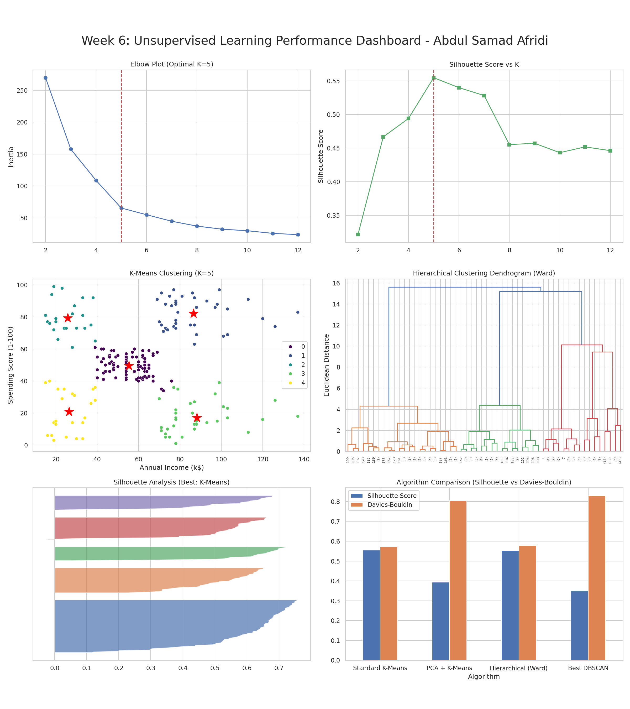

# 🛍️ Mall Customer Segmentation

> Unsupervised machine learning pipeline for identifying distinct customer groups based on demographic and spending behaviour — enabling actionable, data-driven marketing strategies.

---

## 📊 Dataset

**Mall Customers Dataset**

| Property | Detail |
|---|---|
| Source | Kaggle — Mall Customer Segmentation Data |
| Records | 200 customers |
| Features used | `Annual Income (k$)`, `Spending Score (1–100)`, `Age` |
| Target | No label — unsupervised clustering |

The dataset captures basic demographic and behavioural data for mall customers. The two primary features — annual income and spending score — formed the most geometrically separable structure for clustering.

---

## 🤖 Algorithms Applied

### 1. Standard K-Means
Clustered customers directly on the two-feature scaled dataset (`Annual Income` + `Spending Score`). Optimal K was determined using the **Elbow Method**, **Silhouette Score**, and **Davies-Bouldin Index**, all pointing to `K=5`. Used `init='k-means++'` for robust initialisation.

### 2. PCA + K-Means
Applied **Principal Component Analysis** to reduce the three-feature dataset (`X3` including `Age`) to 2 components before clustering. While useful for visualisation, the added `Age` feature introduced noise that obscured the natural cluster boundaries.

### 3. Hierarchical Clustering (Ward Linkage)
Built a **dendrogram** to visualise cluster merges and selected `n_clusters=5` based on clear breakpoints. Compared `ward`, `complete`, `average`, and `single` linkages — Ward linkage produced the most cohesive and well-separated clusters.

### 4. DBSCAN
A density-based approach that automatically detects clusters and **labels outliers as noise**. Tuned `eps` and `min_samples` via a K-distance graph and grid search. Identified 8 noise points, but struggled with the uniformly dense, spherical nature of the natural customer segments.

---

## 🏆 Best Algorithm

| Model | Silhouette Score | Davies-Bouldin Index |
|---|---|---|
| **Standard K-Means** | **0.5547** ✅ | **0.5722** ✅ |
| Hierarchical Clustering | 0.5538 | 0.5779 |
| GridSearchCV PCA + K-Means | 0.3730 | — |
| PCA + K-Means | 0.3931 | 0.8045 |
| DBSCAN | 0.3504 | — |

**Winner: Standard K-Means (K=5)**

With a Silhouette Score of **0.5547** and the lowest Davies-Bouldin Index of **0.5722**, Standard K-Means on the two-feature dataset produced the clearest and most interpretable customer segments. The five identified clusters map neatly to actionable marketing personas (e.g., high income / low spenders, low income / high spenders).

---

## 📸 Clustering Dashboard

> **Note:** Replace the path below with your actual screenshot file once available.



*Figure: Scatter plot of the five K-Means clusters (Annual Income vs. Spending Score), colour-coded by segment, with centroids marked.*

---

## 🛠️ Tools Used

| Tool / Library | Purpose |
|---|---|
| `Python 3.x` | Core programming language |
| `pandas` | Data loading, cleaning, and manipulation |
| `numpy` | Numerical operations |
| `scikit-learn` | K-Means, DBSCAN, Hierarchical Clustering, PCA, `GridSearchCV`, `StandardScaler` |
| `matplotlib` | Scatter plots, Elbow curve, K-distance graph, dendrograms |
| `seaborn` | Enhanced visualisations and pair plots |
| `scipy` | Dendrogram generation via `scipy.cluster.hierarchy` |
| `Jupyter Notebook` | Interactive development and analysis environment |

---

## 📁 Project Structure

```
mall-customer-segmentation/
│
├── data/
│   └── Mall_Customers.csv
│
├── notebooks/
│   └── segmentation_analysis.ipynb
│
├── screenshots/
│   └── clustering_dashboard.png      ← replace with your actual screenshot
│
├── outputs/
│   └── Written_Analysis_Report.md
│
└── README.md
```

---

## 🚀 Getting Started

```bash
# 1. Clone the repository
git clone https://github.com/your-username/mall-customer-segmentation.git
cd mall-customer-segmentation

# 2. Install dependencies
pip install pandas numpy scikit-learn matplotlib seaborn scipy jupyter

# 3. Launch the notebook
jupyter notebook notebooks/segmentation_analysis.ipynb
```

---

## 💡 Key Takeaways

- **Feature selection > feature quantity** — adding `Age` hurt clustering performance despite more information being available.
- **K-Means** works exceptionally well when clusters are roughly spherical and similar in density.
- **DBSCAN** is powerful for anomaly detection but less suited to uniformly distributed, globular clusters.
- **Hierarchical Clustering** is a strong runner-up and offers the added benefit of dendrogram visualisation for interpretability.
